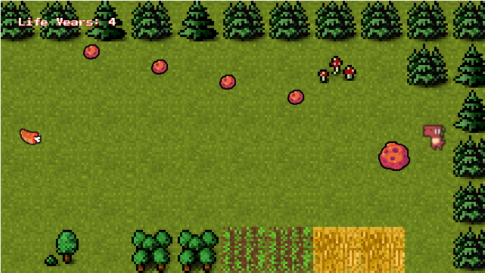
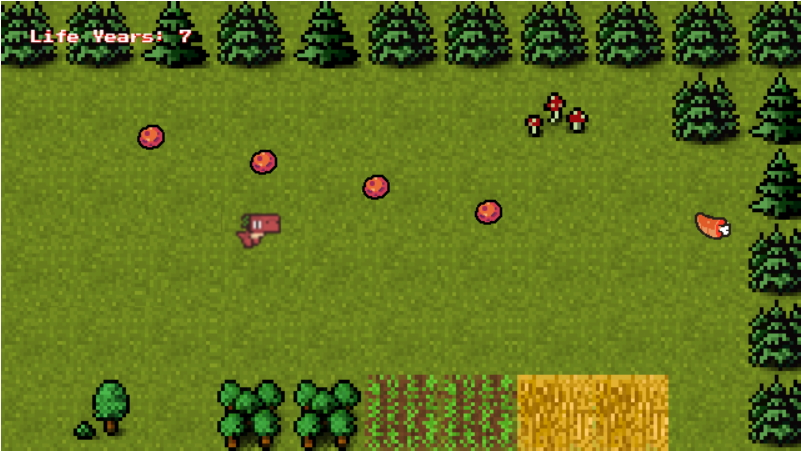

# Save-A-Dino

This is the repository for my finished game Save-a-Dino, a frogger-styled game where you help a little dinosaur not go extinct.
It's made using the [Phaser 3](https://www.phaser.io/phaser3) framework. And it requires a keyboard to play. 

**Game Instructions**

Your dino can only move left and right using the two controls--left arrow and right arrow. The goal of the game is to capture all the food sources. There are 10. The food will always appear on the opposite side of the screen from the last food source. Your dino has to dodge asteroids to get there. Food sources give you 3 points each. Get hit by a small asteroid, lose one point. Get hit by a big asteroid, lose five points. Do not let your score fall below zero and try to get the highest!

**Branches**

There's only one merged branch for this game.

**Installing**

This game is considered finished, but you can still clone the repository.

1. Make sure you have [git](https://git-scm.com/) installed. A copy of [Phaser 3](https://www.phaser.io/phaser3) shouldn't be required but it may be helpful.
2. Click **Clone or download** on the main page of the repository.
3. Copy the provided link and open your terminal(mac) or Git Bash(windows).
4. Change the current working directory to the location where you want the cloned directory to be made. You do this by using the `cd` command. If needed use the internet to search for more command options.
5. Type `git clone` then paste the link. Then press **Enter**. Your local clone will be created.

Alternatively, if you are not familiar with git, after clicking **Clone or download**, you can download a zip folder by clicking **Download ZIP**.

 **Credits**
 
 
 <a href="https://arks.itch.io/dino-characters" target="_blank">"Dino Characters"</a>  
 is licensed under CC 4.0 by <a href="https://twitter.com/ScissorMarks" target="_blank">Arks</a> 

 
 <a href="https://www.gamedevmarket.net/asset/space-shooter-1-5280/" target="_blank">"Superpowers Space Shooter Asset Pack (part 1)"</a>  
 was created by <a href="https://pixel-boy.itch.io/" target="_blank">Pixel-boy</a> 

